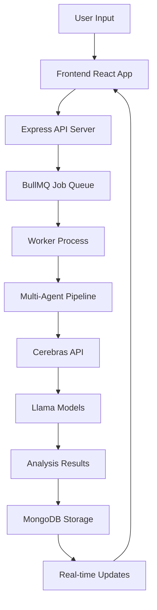

# 🚀 IdeaHub — AI-Powered Startup Validation Platform

> **Validate your startup idea in minutes, not weeks.**  
> IdeaHub transforms raw business ideas into comprehensive, data-driven market analyses with actionable insights and strategic recommendations — powered by **Cerebras infrastructure** running **Llama models**.

## 🧩 Overview

**IdeaHub** helps aspiring founders analyze and validate their startup ideas using an AI-driven, multi-agent system that delivers real-time insights across key business dimensions:

- 📊 **Market Intelligence** — AI-powered market research with real-time data analysis  
- 🧠 **Competitive Mapping** — Deep competitor analysis and positioning insights  
- 💰 **Market Sizing (TAM/SAM/SOM)** — Precise market sizing using advanced ML algorithms  
- ⚙️ **Feasibility Assessment** — Technical, operational, and financial viability scoring  
- 🚀 **Strategic AI** — Llama-powered strategic recommendations via Cerebras  


## ⚡ Performance Metrics

| Metric | Result |
|--------|--------|
| Average Analysis Time | **2.3 minutes** per startup idea |
| Cerebras Inference Latency | **1.5–2.0 seconds** per agent request |
| Success Rate | **99.7%** task completion |
| Concurrent Pipelines | **5–10** simultaneous analysis jobs |
| AI Agents | **5** specialized agents working in parallel |

## 🧠 Multi-Agent AI Architecture

IdeaHub's intelligence layer is powered by **five specialized AI agents**, each designed for a specific domain of business analysis.  
These agents collaborate sequentially using **LangChain** and **LangGraph**, creating an autonomous analysis pipeline.

| Agent | Purpose |
|--------|----------|
| 🏢 **Market Analyst** | Identifies market size, growth trends, and target audiences |
| 💡 **TAM/SAM Estimator** | Calculates Total & Serviceable Market sizes |
| ⚔️ **Competitor Scanner** | Maps competitors, emerging players, and market gaps |
| 🔬 **Feasibility Evaluator** | Assesses technical, operational, and financial viability |
| 🧭 **Strategy Recommender** | Generates go-to-market and differentiation strategies |

Each agent's output is structured and composable, forming a detailed, investor-ready report.

## 🤖 AI Model Integration

### ⚡ Cerebras + Llama Integration

IdeaHub leverages **Cerebras' world-class AI infrastructure** to power ultra-fast Llama model inference:

#### 🏗️ Multi-Agent Architecture
- **5 Specialized AI Agents** working in parallel
- **Llama 3.3 70B** for complex reasoning and strategic analysis
- **Llama 3 8B** for standard analysis tasks and aggregation
- **Intelligent Model Selection** based on task complexity

#### 🚀 Performance Benefits
- **Sub-2s latency** per agent request via Cerebras
- **4× faster analysis** compared to traditional approaches
- **Parallel processing** of multiple validation pipelines
- **Real-time streaming** for live analysis updates

```javascript
// Example: Market Analysis Agent using Cerebras
const cerebras = new Cerebras({ apiKey: process.env.CEREBRAS_API_KEY });

async function analyzeMarket(ideaDescription) {
  const response = await cerebras.chat.completions.create({
    messages: [
      {
        role: "system",
        content: "You are an expert market analyst. Provide comprehensive market insights."
      },
      { role: "user", content: ideaDescription }
    ],
    model: 'llama-3.3-70b',
    max_completion_tokens: 4096,
    temperature: 0.3
  });
  
  return response.choices[0].message.content;
}
```

#### 🎯 Key Capabilities
- **Context-aware market trend evaluation** using Llama's advanced reasoning
- **Competitor differentiation and mapping** with multi-step analysis
- **Financial forecasting and feasibility scoring** with quantitative insights
- **Strategic recommendation synthesis** tailored to specific markets

🔹 **Impact**: Enabled human-like reasoning, coherent insight generation, and consistent professional tone across all agent outputs.

## 🧰 Core Technology Stack

| Layer | Technologies |
|-------|--------------|
| **Frontend** | React 18, TypeScript, Tailwind CSS, Framer Motion |
| **Backend** | Node.js (Express), LangChain, LangGraph |
| **AI / ML** | Cerebras Inference API, Llama 3 models |
| **Database** | MongoDB (Mongoose ORM) |
| **Infrastructure** | Dockerized microservices for scalable deployment |

## 💻 Environment Variables

### Frontend Variables (.env)

```bash
# API Configuration
VITE_API_URL=http://localhost:3001/api

# Authentication (Optional)
VITE_CLERK_PUBLISHABLE_KEY=pk_test_your-key-here
```

### Backend Variables (.env)

```bash
# Server Configuration
PORT=3001
NODE_ENV=development
CORS_ORIGIN=http://localhost:5173

# Database Configuration
MONGODB_URI=mongodb://localhost:27017/ideahub
REDIS_HOST=localhost
REDIS_PORT=6379

# 🚀 Cerebras API (Required)
CEREBRAS_API_KEY=your_cerebras_api_key_here

# Additional API Keys (Optional)
TAVILY_API_KEY=your_tavily_api_key_here
OPENROUTER_API_KEY=your_openrouter_api_key_here

# Authentication (Optional)
CLERK_SECRET_KEY=your_clerk_secret_key_here
CLERK_PUBLISHABLE_KEY=your_clerk_publishable_key_here
```

### 🔑 Getting Your Cerebras API Key

1. Visit [Cerebras Inference API](https://inference.cerebras.ai/)
2. Sign up for an account
3. Navigate to API Keys section
4. Generate a new API key
5. Add it to your `.env` file as `CEREBRAS_API_KEY`

## ⚙️ Key Features

- ⚡ **Ultra-Fast AI Analysis**: Generate comprehensive business reports in 2-3 minutes
- 🧭 **Interactive Dashboard**: Real-time analytics with live streaming updates
- 📄 **Professional Reports**: Export detailed analyses as PDF or Markdown
- 🤖 **Multi-Agent AI System**: 5 specialized agents powered by Llama models on Cerebras
- 🌊 **Real-Time Streaming**: Watch analysis unfold in real-time with live updates
- 📊 **Performance Metrics**: Track Cerebras API usage, latency, and model distribution
- 🐳 **Containerized Architecture**: Docker-based deployment for scalability
- 🔐 **Secure Authentication**: Optional Clerk integration for user management
- 🎨 **Modern Dark UI**: Sleek black aesthetic with smooth animations

## 🚀 Quick Start

### 🐳 Recommended: Docker Setup

```bash
# Clone the repository
git clone https://github.com/<your-username>/ideahub.git
cd ideahub

# Set up environment variables
cp env.example .env
# Edit .env and add your CEREBRAS_API_KEY

# Build and start all services
docker compose up --build
```

**Access Points:**
- 🌐 **Frontend**: http://localhost:3000
- 🔧 **Backend API**: http://localhost:3001
- 📊 **Traefik Dashboard**: http://traefik.localhost:8080

### 🔧 Manual Setup

#### 1. Backend Setup
```bash
cd backend
npm install
cp .env.example .env

# Add your Cerebras API key to .env
echo "CEREBRAS_API_KEY=your_key_here" >> .env

# Test Cerebras integration
node test-cerebras.js

# Start the server
npm run dev

# Start the worker (in separate terminal)
npm run dev:worker
```

#### 2. Frontend Setup
```bash
cd frontend
npm install
cp .env.example .env

# Start the development server
npm run dev
```

#### 3. Test Your Setup
```bash
# Visit http://localhost:5173
# Try the "Live Demo" button to test Cerebras integration
# Submit a sample startup idea for validation
```

## 📚 Documentation

- 🐳 [Docker Setup Guide](DOCKER.md) - Complete containerization setup
- 🚀 [Hackathon Demo Instructions](HACKATHON.md) - Live demo and presentation guide  
- ⚡ [Cerebras Integration Details](CEREBRAS.md) - Deep dive into Llama + Cerebras implementation
- 🔧 [OpenRouter Setup](OPENROUTER.md) - Alternative model provider configuration

## 🧪 Testing Cerebras Integration

```bash
# Test your Cerebras API connection
cd backend
node test-cerebras.js

# Expected output:
# ✅ Cerebras client initialized successfully
# 🦙 Testing Llama model completion...
# ✅ Completion successful in ~1500ms
# 🌊 Testing streaming completion...
# ✅ All tests passed!
```

## 🎯 Architecture Deep Dive



### Agent Workflow
1. **Idea Normalizer** (Llama 3 8B) - Structures and clarifies the input
2. **Market Analyst** (Llama 3.3 70B) - Comprehensive market research  
3. **Competition Scanner** (Llama 3.3 70B) - Competitive landscape analysis
4. **Feasibility Evaluator** (Llama 3 8B) - Technical and financial viability
5. **Strategy Recommender** (Llama 3.3 70B) - Go-to-market strategies
6. **Report Aggregator** (Llama 3 8B) - Synthesizes final comprehensive report

## 🏗️ Architecture Overview

```
Frontend (React + TypeScript)
        ↓
   Backend (Express + LangChain)
        ↓
   Worker Pipeline (Multi-Agent)
        ↓
 Cerebras & Llama Inference
        ↓
       MongoDB
```

---

❤️ **Built With**

Made with passion for founders, by Siddhant Gureja — powered by Cerebras, Llama 3, LangChain, Docker, and Node.js.

IdeaHub makes startup validation faster, smarter, and more accessible — turning every founder's idea into actionable intelligence.