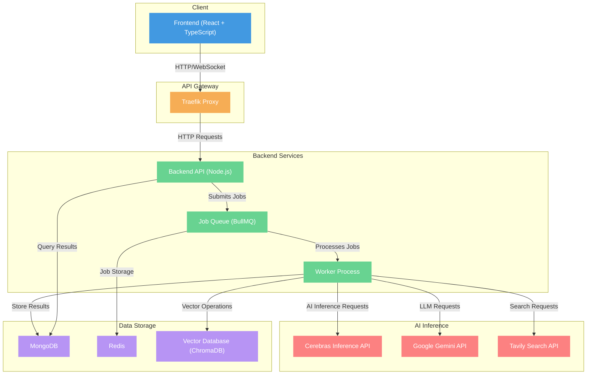

```mermaid
flowchart TB
    subgraph Client
        UI["Frontend (React + TypeScript)"]
    end
    
    subgraph "API Gateway"
        Traefik["Traefik Proxy"]
    end
    
    subgraph "Backend Services"
        API["Backend API (Node.js)"]
        Worker["Worker Process"]
        Queue["Job Queue (BullMQ)"]
    end
    
    subgraph "AI Inference"
        Cerebras["Cerebras Inference API"]
        Gemini["Google Gemini API"]
        Tavily["Tavily Search API"]
    end
    
    subgraph "Data Storage"
        MongoDB["MongoDB"]
        Redis["Redis"]
        VectorDB["Vector Database (ChromaDB)"]
    end
    
    UI -- "HTTP/WebSocket" --> Traefik
    Traefik -- "HTTP Requests" --> API
    API -- "Submits Jobs" --> Queue
    Queue -- "Processes Jobs" --> Worker
    Worker -- "AI Inference Requests" --> Cerebras
    Worker -- "LLM Requests" --> Gemini
    Worker -- "Search Requests" --> Tavily
    Worker -- "Store Results" --> MongoDB
    API -- "Query Results" --> MongoDB
    Queue -- "Job Storage" --> Redis
    Worker -- "Vector Operations" --> VectorDB
    
    classDef frontend fill:#4299E1,color:white,stroke-width:0;
    classDef gateway fill:#F6AD55,color:white,stroke-width:0;
    classDef backend fill:#68D391,color:white,stroke-width:0;
    classDef ai fill:#FC8181,color:white,stroke-width:0;
    classDef storage fill:#B794F4,color:white,stroke-width:0;
    
    class UI frontend;
    class Traefik gateway;
    class API,Worker,Queue backend;
    class Cerebras,Gemini,Tavily ai;
    class MongoDB,Redis,VectorDB storage;
```
